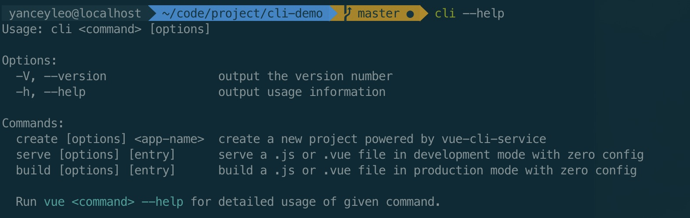
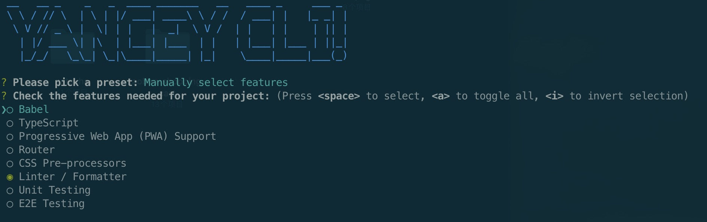
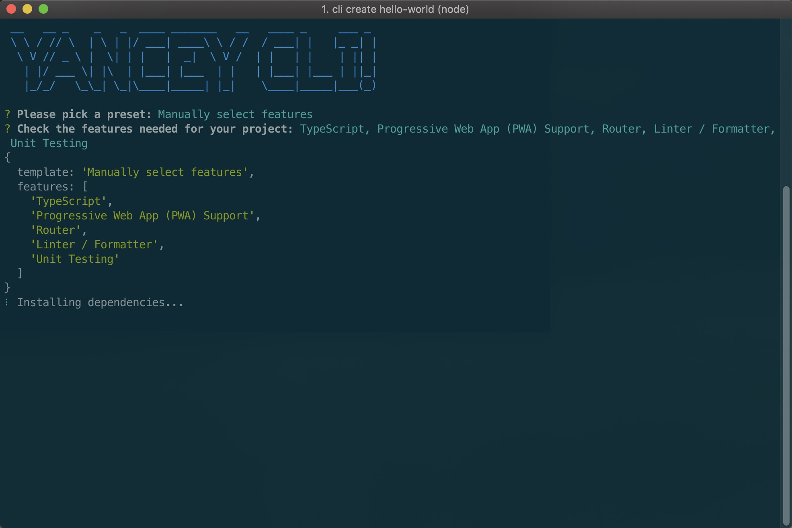

# cli demo

这是我写的一个脚手架的 demo, 进入到工程后, 使用 `yarn link` 将该项目的 bin 添加到 `node_module` 中, 这样你就可以愉快的在终端使用 cli 了.

## 用法

项目预置了几个 command, 如通过 `cli --help` 输出如下:

为进一步进行交互, 你可以通过 `cli create xxx` 来模拟 vue 创建的方法.

## License

cli-demo is [MIT licensed](https://opensource.org/licenses/MIT).
